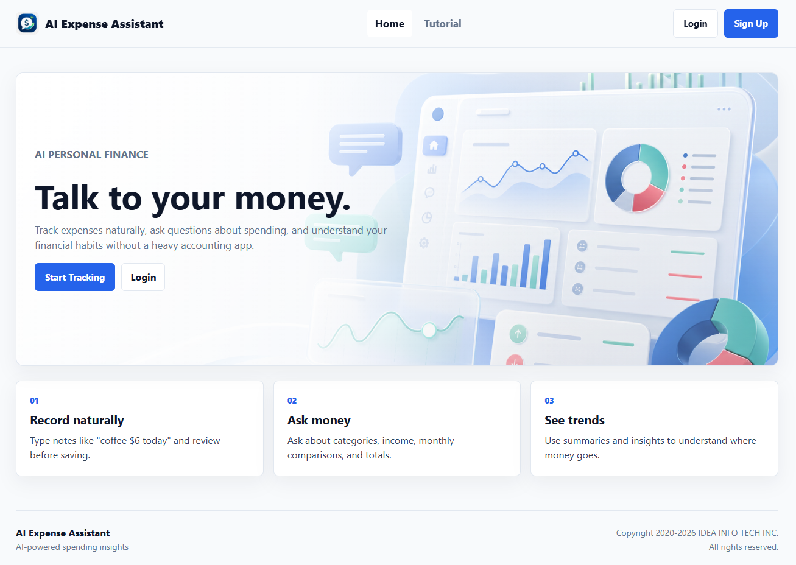
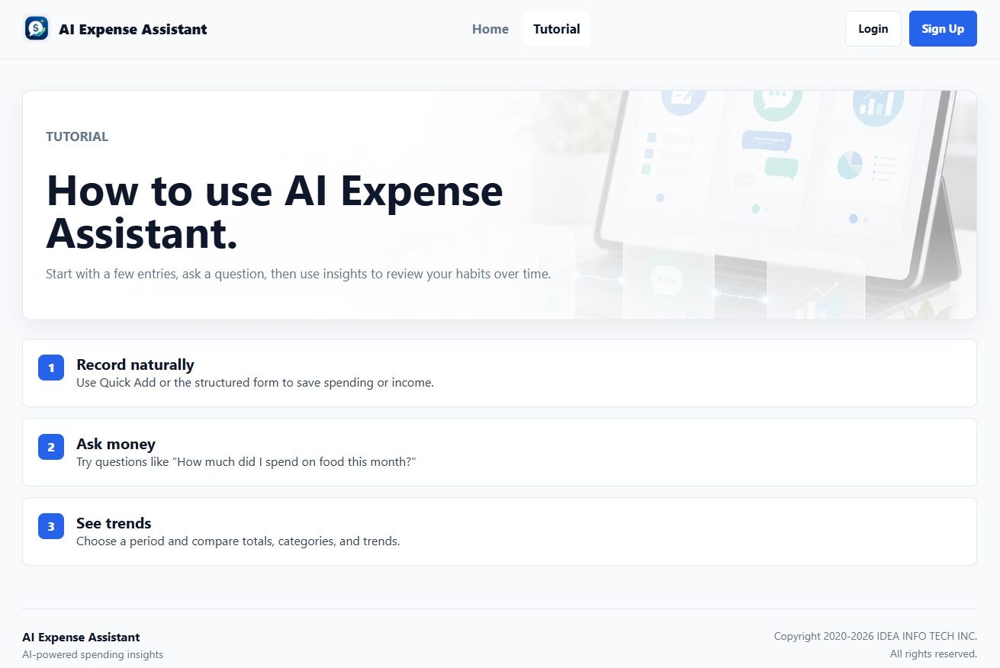
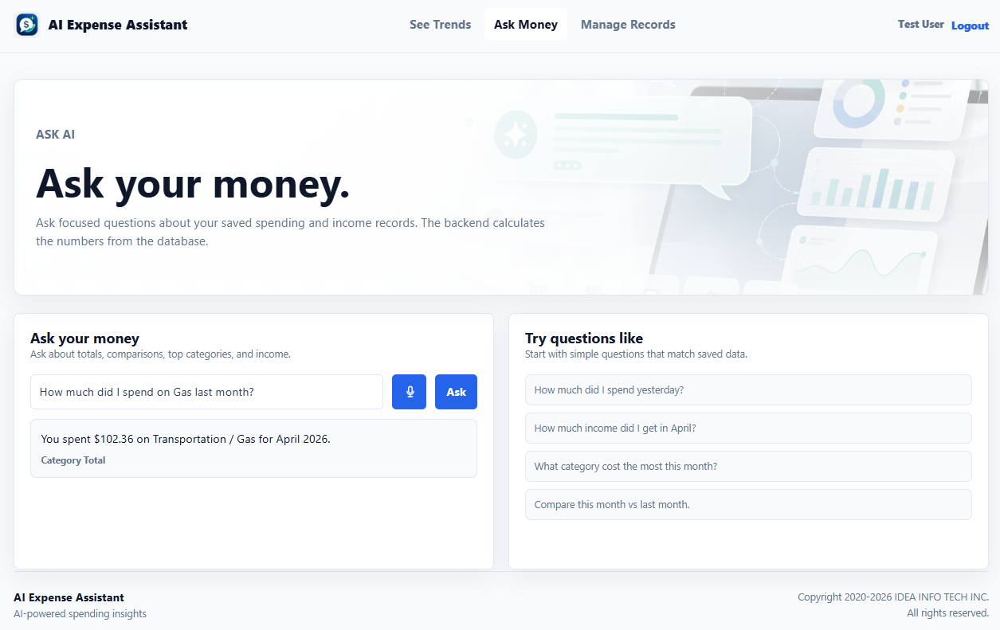
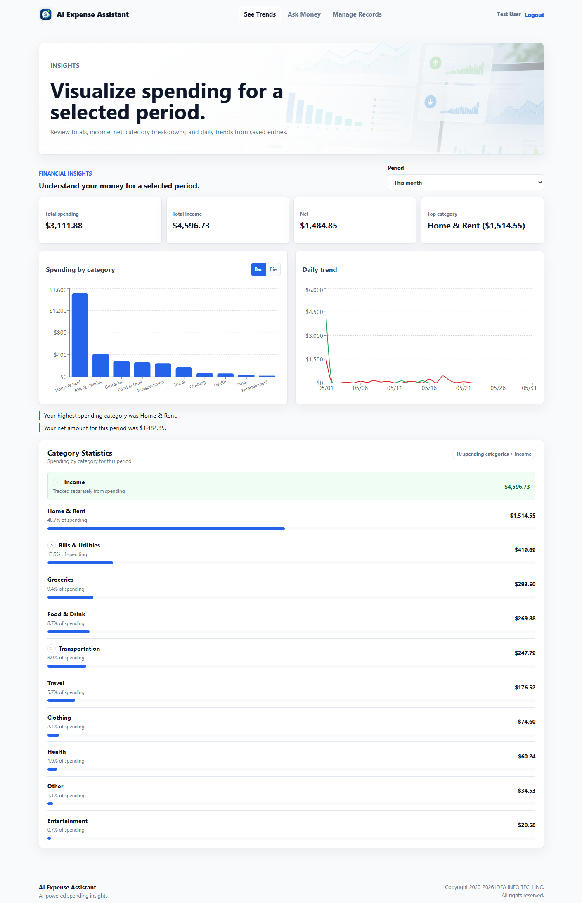
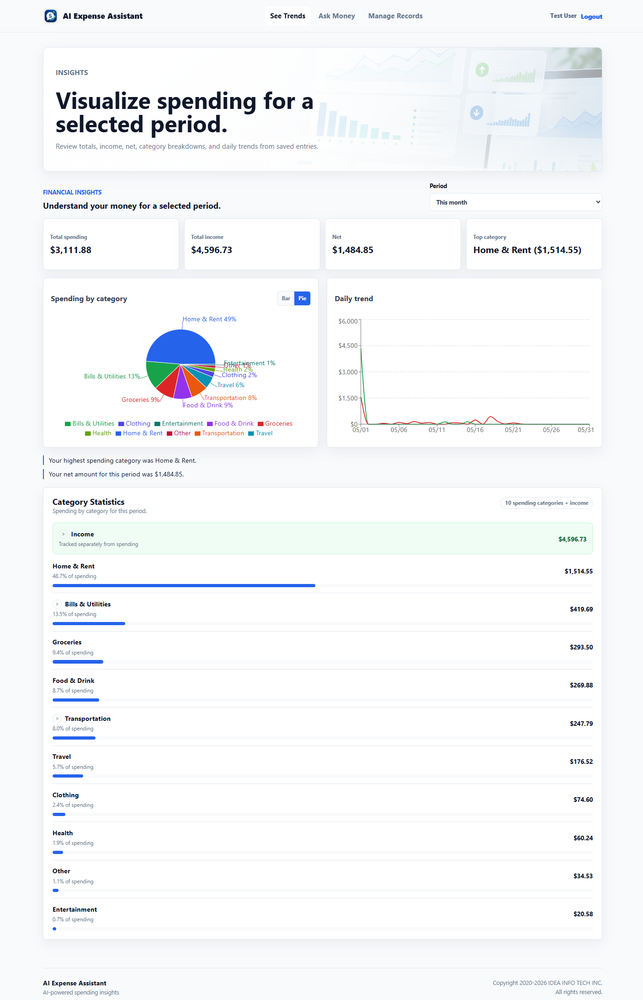
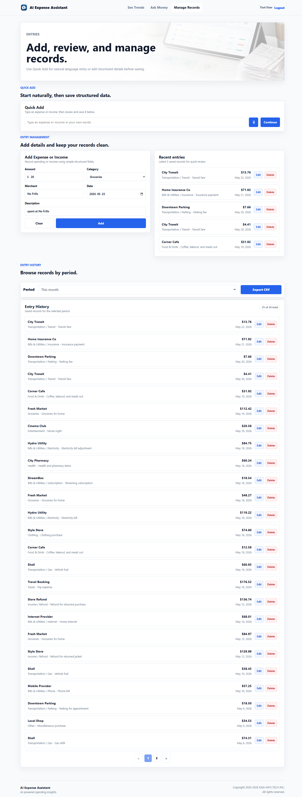

# AI Expense Assistant

AI Expense Assistant is a full-stack personal finance workspace for tracking spending and asking natural-language questions about financial history.

The goal is to feel like "ChatGPT for personal spending": users can manually add expenses or income, use Quick Add to describe a transaction in plain English, review charts and summaries, and ask AI questions grounded in saved records.

## Live Demo

App:

```text
https://ai-expense-assistant-bay.vercel.app
```

Demo account:

```text
Email: test@example.com
Password: Password123!
```

## Features

- JWT authentication with an httpOnly cookie
- Manual expense and income entry
- Natural-language Quick Add for expenses and income
- AI-assisted amount, category, subcategory, merchant, and date detection
- Protected app workspace with Insights, Ask AI, and Entries pages
- Period-based financial insights
- Spending by category chart and daily spending/income trend chart
- Expandable category statistics with subcategory breakdowns
- Recent entries and paginated entry history
- Edit and delete saved records with delete confirmation
- CSV export for selected periods
- PostgreSQL data model managed with Prisma

## Technical Highlights

- Full-stack TypeScript implementation with separate React/Vite client and Express API server
- Protected API routes using JWT verification middleware and user-scoped Prisma queries
- Secure password storage with `bcryptjs`
- Cookie-based auth using an `httpOnly` cookie, with Vercel production requests proxied through same-origin `/api/*` routes for more reliable mobile browser behavior
- AI workflow designed around structured outputs instead of free-form database access
- Prisma-backed financial calculations so totals, charts, exports, and AI answers are grounded in saved records
- Income is modeled as an entry category but excluded from spending totals and category spending charts
- Reusable period selection logic for insights, history filtering, and CSV export workflows
- Graceful fallback behavior when `OPENAI_API_KEY` is not configured

## Tech Stack

Frontend:

- React
- Vite
- TypeScript
- React Router
- Recharts

Backend:

- Node.js
- Express
- TypeScript
- Prisma ORM
- PostgreSQL
- bcryptjs
- JSON Web Tokens
- OpenAI Node SDK

AI:

- OpenAI API through the official server-side Node SDK for structured expense parsing and financial answers
- Deterministic fallback parsing when no OpenAI API key is configured

## App Flows

```text
React client
  -> typed service layer
  -> Express REST API
  -> auth middleware
  -> route handlers
  -> service functions
  -> Prisma
  -> PostgreSQL
```

AI-specific routes call the server-side OpenAI SDK when `OPENAI_API_KEY` is configured, then run safe backend logic against Prisma/PostgreSQL as needed.

The app keeps user-facing workflows in the client and financial/business rules on the server. The client never calls OpenAI directly and never receives `OPENAI_API_KEY`. It also never calculates authoritative totals for summaries, insights, exports, or AI answers. Those values come from server-side Prisma queries scoped to the authenticated user.

### Authentication Flow

```text
signup/login
  -> validate request
  -> hash or compare password with bcryptjs
  -> sign JWT
  -> store JWT in ai_expense_auth httpOnly cookie
  -> protected requests use credentials: "include"
  -> requireAuth middleware verifies cookie and loads req.user
```

The app does not store tokens in `localStorage`. Each protected expense and AI route uses the authenticated user id so one user's records are not visible to another user.

In local development, the browser calls the API directly and cookies use `SameSite=Lax`. In production, the browser calls same-origin Vercel `/api/*` routes, and Vercel proxies those requests to the Render backend so the auth cookie remains first-party to the deployed app.

### AI Question Flow

The Ask AI feature uses AI to understand the question, not to calculate money.

```text
User question
  -> POST /api/ai/ask
  -> OpenAI SDK structured intent parsing, or rule-based fallback
  -> safe backend intent execution
  -> Prisma query for the authenticated user's records
  -> deterministic TypeScript calculation
  -> grounded natural-language response
```

Example:

```text
"How much did I spend on gas last month?"
  -> intent: category_total
  -> category: Transportation
  -> subcategory: Gas
  -> period: last_month
```

The backend then queries saved entries for that date range and user, filters by category/subcategory, sums the values, and returns the answer. The AI does not generate SQL and does not invent financial data.

### Quick Add Flow

```text
Natural-language entry text
  -> POST /api/ai/parse-expense
  -> OpenAI SDK structured parsing, or deterministic fallback parser
  -> parsed amount/category/subcategory/merchant/date
  -> user reviews the populated form
  -> saved through POST /api/expenses
```

This keeps the final saved record under user control while still making entry creation fast.

### Insights Flow

```text
Selected period
  -> GET /api/expenses/insights?startDate=YYYY-MM-DD&endDate=YYYY-MM-DD
  -> Prisma query
  -> split Income from spending
  -> calculate totalSpending, totalIncome, net, byCategory, bySubcategory, dailyTrend
  -> render insight cards and charts
```

Chart data is calculated from PostgreSQL records, not from AI responses.

## Project Structure

```text
.
|-- client/                         # Frontend app (React/Vite)
|   |-- src/
|   |   |-- assets/                 # Images and visual assets used by pages
|   |   |-- components/             # Reusable UI components and app widgets
|   |   |-- constants/              # Shared client-side category and subcategory options
|   |   |-- context/                # Auth state provider and hooks
|   |   |-- layouts/                # Public and protected route shells
|   |   |-- pages/                  # Route-level page components
|   |   |-- services/               # Typed API client functions
|   |   |-- types/                  # Shared TypeScript types for client data
|   |   |-- App.tsx                 # React Router route definitions
|   |   `-- main.tsx                # Browser entry point
|   |-- index.html                  # Vite HTML template
|   |-- package.json                # Frontend scripts and dependencies
|   `-- vite.config.ts              # Vite configuration
|
|-- server/                         # Backend API (Node.js/Express)
|   |-- src/
|   |   |-- middleware/             # Request middleware such as JWT auth protection
|   |   |-- routes/                 # REST API route handlers
|   |   |-- services/               # Business logic, AI parsing, and Ask AI execution
|   |   |-- types/                  # Server-side TypeScript request/type helpers
|   |   |-- utils/                  # Shared utilities for Prisma, OpenAI, and auth tokens
|   |   `-- index.ts                # Express application entry point
|   |-- prisma/
|   |   |-- migrations/             # Prisma migration history
|   |   |-- schema.prisma           # Database schema for users and entries
|   |   `-- seed.ts                 # Demo user and sample financial data
|   |-- .env.example                # Backend environment variable template
|   |-- package.json                # Backend scripts and dependencies
|   `-- prisma.config.ts            # Prisma CLI configuration
|
|-- DEPLOYMENT.md                   # Render/Vercel deployment guide
|-- README.md                       # Project overview and setup guide
`-- .gitignore                      # Files excluded from Git
```

## Getting Started

### Prerequisites

- Node.js
- npm
- PostgreSQL

### 1. Clone the repository

```bash
git clone https://github.com/aislandmin/AI_Expense_Assistant.git
cd ai-expense-assistant
```

### 2. Install dependencies

```bash
cd server
npm install

cd ../client
npm install
```

### 3. Configure environment variables

Create `server/.env` from the example file:

```bash
cd server
cp .env.example .env
```

Then update `DATABASE_URL` and `JWT_SECRET` in `server/.env`.

The server environment variables are:

| Variable | Required | Purpose |
| --- | --- | --- |
| `DATABASE_URL` | Yes | PostgreSQL connection string used by Prisma. Required for migrations, seeding, and any database-backed API route. |
| `JWT_SECRET` | Yes in production | Secret used to sign the auth cookie JWT. Local development has a fallback, but setting this locally is still recommended. |
| `CLIENT_URL` | Yes in production | Frontend origin allowed by CORS. Defaults to `http://localhost:5173` locally. In production, set this to the exact Vercel frontend origin. |
| `NODE_ENV` | Yes in production | Set to `production` on Render so auth cookies use `SameSite=None; Secure` for Vercel-to-Render requests. |
| `PORT` | No | Express API port. Defaults to `5000`. Do not set this on Render because Render provides it automatically. |
| `OPENAI_API_KEY` | Yes for AI features | Server-only key used by the OpenAI SDK. Required for OpenAI-powered Quick Add parsing and AI financial answers. If empty, limited fallback behavior is used where available. |
| `OPENAI_MODEL` | Yes for AI features | OpenAI model name used by the server SDK. The code defaults to `gpt-4o-mini`, but production deployments should set it explicitly so AI behavior is intentional and easy to change. |

Create `client/.env` for local development if your API URL is different from the default:

```env
VITE_API_URL=http://localhost:5000
```

For production on Vercel, use `API_URL` instead. See the deployment section below.

### 4. Set up the database

```bash
cd server
npx prisma migrate dev
npm run db:seed
```

The seed script creates demo data for:

```text
Email: test@example.com
Password: Password123!
```

The demo entries span the latest 24 months relative to the day the seed script runs. They include spending, salary income, refunds, reimbursements, gifts, bills, transportation subcategories, and current-month examples for Ask AI and expandable category statistics. Current-month demo entries may include dates later in the current month so full-month charts have useful data.

### 5. Run the app locally

Start the API:

```bash
cd server
npm run dev
```

Start the client in a second terminal:

```bash
cd client
npm run dev
```

Open:

```text
http://localhost:5173
```

## Available Scripts

Client:

```bash
npm run dev
npm run build
npm run lint
npm run preview
```

Server:

```bash
npm run dev
npm run build
npm start
npm test
npm run db:migrate:deploy
npm run db:seed
```

Useful Prisma commands:

```bash
npx prisma migrate dev
npx prisma migrate deploy
npx prisma studio
```

## Deployment

Recommended production setup:

```text
Frontend: Vercel
Backend API: Render Web Service
Database: Render Postgres
```

For a step-by-step deployment reference, see [DEPLOYMENT.md](./DEPLOYMENT.md).

### 1. Create Render Postgres

Create a PostgreSQL database on Render first. Use the database's internal connection string as the backend `DATABASE_URL` because the API server will also run on Render.

### 2. Deploy Backend On Render

Create a Render Web Service from the GitHub repo.

```text
Root Directory: server
Build Command: npm ci --include=dev && npm run build && npm run db:migrate:deploy
Start Command: npm start
```

Set backend environment variables on Render:

```env
DATABASE_URL=postgresql://...
JWT_SECRET=use-a-long-random-production-secret
CLIENT_URL=https://your-client.vercel.app
OPENAI_API_KEY=your-openai-api-key
OPENAI_MODEL=gpt-4o-mini
NODE_ENV=production
```

In hosted dashboards such as Render and Vercel, enter environment variable values without quotes. Local `.env` files may use quotes when needed, but plain unquoted values are clearer for these values.

Do not put `OPENAI_API_KEY` in the frontend environment.

For a deployed demo with representative financial history, seed the Render database after the backend is connected:

```bash
cd server
npm run db:seed
```

### 3. Deploy Frontend On Vercel

Create a Vercel project from the same GitHub repo.

```text
Root Directory: client
Build Command: npm run build
Output Directory: dist
```

Set the frontend environment variable on Vercel:

```env
API_URL=https://your-render-backend.onrender.com
```

`API_URL` is read by the Vercel `/api/*` proxy function. The production browser app calls same-origin `/api/*` routes, and Vercel forwards them to Render. Do not set `VITE_API_URL` on Vercel unless you intentionally want the browser to call Render directly.

After Vercel gives you the final frontend URL, set that URL as `CLIENT_URL` on Render and redeploy the backend so CORS and cookies work correctly.

## Testing

Run the backend test suite from the server folder:

```bash
cd server
npm test
```

The backend tests use Node's built-in test runner with `supertest`. They cover protected API behavior, Quick Add fallback parsing, Ask AI answers, income-vs-spending summaries, insights, CSV export, and parser rules. The tests mock Prisma and do not require a live PostgreSQL database or real OpenAI API call.

## Main API Routes

Auth:

```text
POST /api/auth/signup
POST /api/auth/login
POST /api/auth/logout
GET  /api/auth/me
```

Entries:

```text
POST   /api/expenses
GET    /api/expenses
PUT    /api/expenses/:id
DELETE /api/expenses/:id
GET    /api/expenses/summary
GET    /api/expenses/insights
GET    /api/expenses/export
```

AI:

```text
POST /api/ai/parse-expense
POST /api/ai/ask
```

The web client and any future mobile app should use these backend AI endpoints. Do not put `OPENAI_API_KEY` in client `.env` files, browser code, or mobile app bundles.

## Product Notes

Income is tracked separately from spending. Summary and insight totals treat:

- `totalSpending` as spending only
- `totalIncome` as income only
- `net` as income minus spending
- `bySubcategory` as expandable detail under top-level category statistics

Chart data and insight totals are calculated from saved PostgreSQL records through Prisma. AI is used to parse natural-language input and explain grounded results, not to invent financial data.

## Data Model

The core data model is built around two Prisma models:

- `User`: name, email, hashed password, and related entries
- `Expense`: amount, category, optional subcategory, description, merchant, date, and optional user relation

`Expense` is used for both spending and income entries. Income is stored with category `Income`, then separated in summary and insight calculations.

Income entries can use optional subcategories: `Salary`, `Refund`, `Reimbursement`, `Gift`, and `Other`. Refunds for returned purchases should be saved as positive `Income / Refund` entries, not negative expenses.

## Validation and Error Handling

- Auth endpoints validate required fields and email format.
- Passwords must be at least 8 characters on signup.
- Protected routes return `401` when the auth cookie is missing or invalid.
- Production auth requires `NODE_ENV=production`, `CLIENT_URL` set to the Vercel frontend URL, Vercel `API_URL` set to the Render backend URL, and frontend requests using `credentials: "include"`.
- Date range endpoints validate `YYYY-MM-DD` inputs and reject invalid ranges.
- Client forms show user-facing validation and request errors.
- AI parsing falls back to deterministic rules when OpenAI is unavailable.

## Frontend Notes

- Public routes: Home, Tutorial, Login, Sign Up
- Protected workspace routes: Insights, Ask AI, Entries
- Browser autofill is supported with standard `name`, `id`, and `autoComplete` attributes on auth forms.
- Voice input on the Ask page uses the browser Web Speech API when available; submitted text still goes through the same Ask AI backend flow.
- Entry edit/delete actions are available directly on rows, with delete confirmation before removal.

## Quality Checks

Run these before pushing changes:

```bash
cd client
npm run lint
npm run build

cd ../server
npm test
npx tsc --noEmit
```

## Status

AI Expense Assistant is a deployed full-stack AI finance application built around a practical workflow: add entries, inspect financial patterns, and ask grounded questions about saved spending history.

## Screenshots

### Home Page

Public landing page introducing AI Expense Assistant and the main product workflow.



### Tutorial Page

Guided overview that explains how to use the app, add records, review trends, and ask AI financial questions.



### Ask Money Page

AI chat workspace for asking questions about saved financial history by typing or using voice input.



### See Trends Page - Bar Chart

Financial insights page showing spending, income, net, category statistics, and spending by category as a bar chart.



### See Trends Page - Pie Chart

Financial insights page with the category breakdown switched to pie chart view.



### Manage Records Page

Record management page for Quick Add by typing or voice input, manual editing, entry history, and CSV export.


